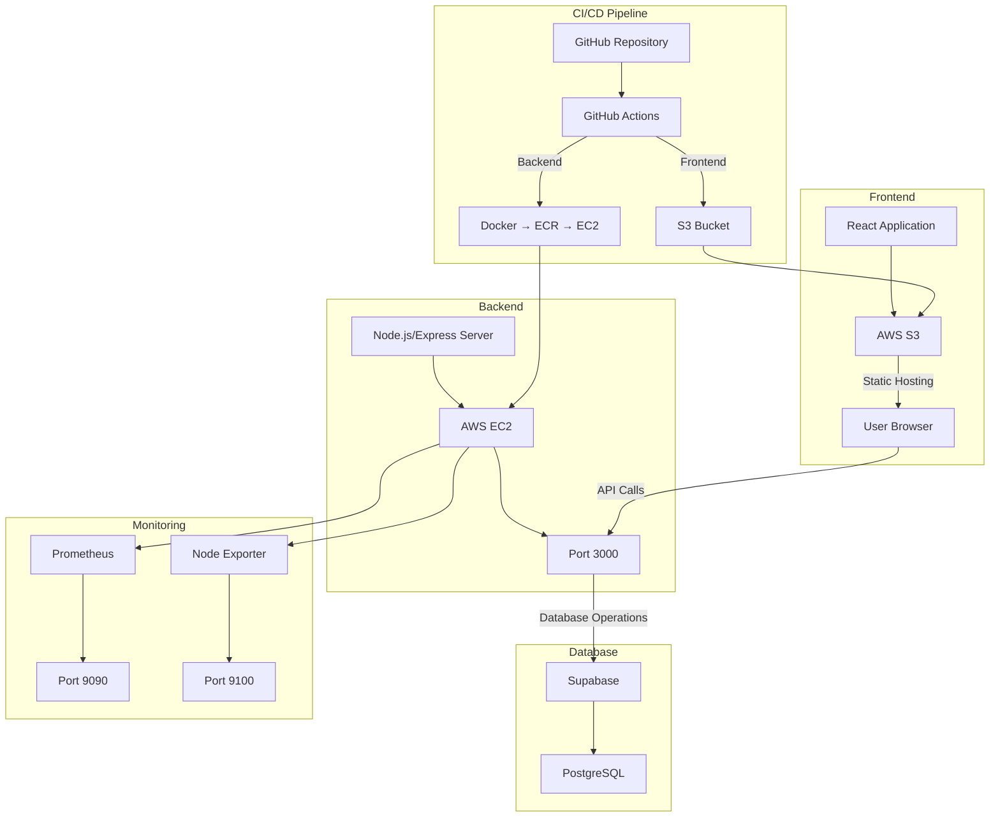

# QuizSpark Architecture Diagram

## Key Components

1. **Frontend Layer**:
   - React-based web application
   - Hosted on AWS S3 for static website hosting
   - Accessible via S3 website endpoint

2. **Backend Layer**:
   - Node.js/Express server
   - Deployed on AWS EC2 instance
   - Running on port 3000
   - Handles API requests and business logic

3. **Database Layer**:
   - Supabase as the backend-as-a-service
   - PostgreSQL database
   - Handles data persistence and authentication

4. **CI/CD Pipeline**:
   - GitHub Actions for automation
   - Separate workflows for frontend and backend
   - Backend: Docker → ECR → EC2 deployment
   - Frontend: Build → S3 deployment

5. **Monitoring Stack**:
   - Prometheus for metrics collection
   - Node Exporter for system metrics
   - Both running on the EC2 instance
   - Accessible on ports 9090 and 9100 respectively

6. **Security & Quality**:
   - CodeQL analysis for security scanning
   - Automated testing through GitHub Actions
   - Infrastructure as Code (Terraform) 